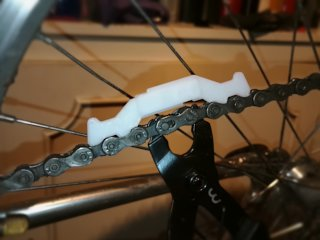
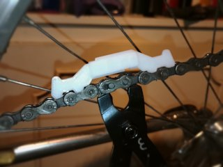
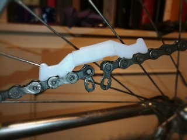
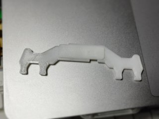

# Chain Opening Aid
*A 3D printable tool to keep bicycle chains together while installing or removing their master link*

### License
[Creative Commons - Attribution](https://creativecommons.org/licenses/by/4.0/)

### Gallery

[🔎](images/photo1.jpg) [🔎](images/photo2.jpg) [🔎](images/photo3.jpg) [🔎](images/photo4.jpg)

## Description and Instructions

This is a simple tool that makes it easier to mount or remove bicycle chains with a master link or KTC ‘missinglink’ or similar system. Without this tool, one sort of needs 3 hands to pull the two ends of the chain together and then insert the link, which can be especially tricky when having to fight the spring action of a derailleur.

This tool makes it easy to hook the two ends of the chain together and then insert or remove the link. The two ends of the tool can slide up to 5 mm w.r.t. each other, such that the link can be opened or closed while the tool is mounted.

In case you were wondering: no, you don't need different widths of this tool for different widths of derailleur chains. Even though their outside width varies, the width between inner plates is the same for a 6-speed chain as for an 11-speed chain: 3/32 inch or 2.4 mm. The tool is 2 mm thick to fit easily even when the chain is caked with dirt. Only in case you're going to use this on a single-speed chain, you could consider scaling it up in the Z axis to make it wider, but that shouldn't be necessary.

### Printing

The parts are press-fit, which makes it important to print reasonably accurately. Layer height and infill don't really matter as long as the end result is strong. I prefer to print this in PETG because it has low friction and is tough and wear resistant.

If your slicing program has an option for preventing “elephant's foot syndrome” (squashed first layer), you should enable it.

### Assembly

Position the `side2-bottom` part in the same orientation as its STL file (hole to the left). Then place `part1` and `part2` on top, with the tab going through `part2`. Then push the `side1-top` part into the bottom one, with its tab going through `part1`. When printed accurately, the parts will snap together without too much force, and stay together. If they're too loose, you could try adding glue. If they're too tight and you can't push the pins into the slots, sand or scrape the parts until they fit.
